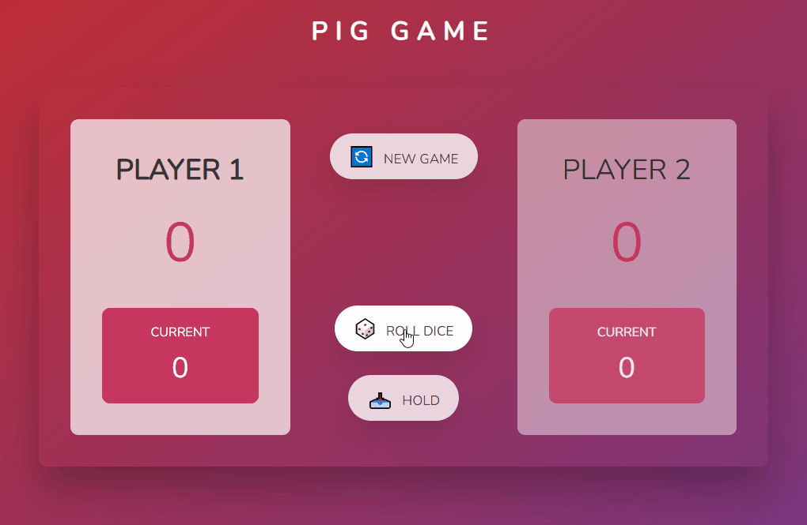
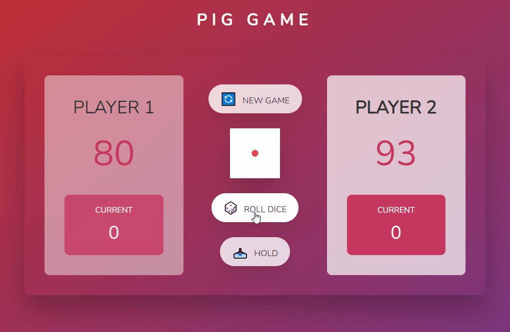
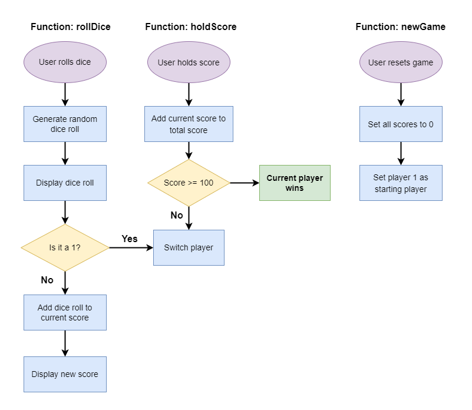

# Pig Game 🎲

This project is a dice game built with HTML, SASS, and JavaScript. The goal was to practice DOM manipulation and it was inspired by the project created in the Complete JavaScript Course - From Zero to Expert by [Jonas Schmedtmann](https://www.udemy.com/course/the-complete-javascript-course/).

The Pig Game is a dice game in which two players race to reach 100 points. The players take turns to roll a die as many times as they wish, adding all roll results to a current total, but losing their gained score for the turn if they roll a 1.

### Gameplay:

Each turn, a player repeatedly rolls a die until either a 1 is rolled or the player decides to "hold":

- If the player rolls a 1, they score nothing and it becomes the next player's turn.
- If the player rolls any other number, it is added to their current score and the player's turn continues.
- If a player chooses to "hold", their current score is added to their total score, and it becomes the next player's turn.
  
The first player to score 100 or more points wins.

 

## 🛠️ Technologies

- HTML
- CSS/SASS
- JavaScript

## 🔗 Link

- [Pig Game](https://julianachagas.github.io/pig-game/)

 

## 💻 Demo

   

- Winner: Player 2

   

 

## 💡 Flowchart

   

## 👩🏻‍💻 Author

---

##### Made with 💜 by Juliana Chagas
